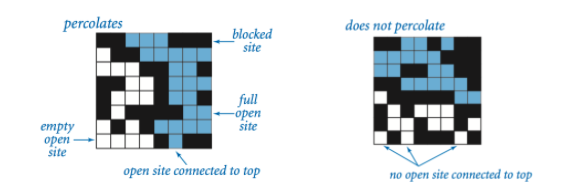
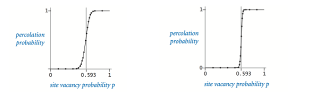

# Задача о перколяции
С задачей о перколяции можно встретить в разных областях науки: при анализе зависимости проводимости тонких композитных пленок от соотношения концентраций металла и диэлектрика в составе пленок;  при определение связности компьютерных сетей; при определении условий просачивания жидкостей через пористую поверхность. Чтобы формально описать задачу перколяции рассматривают модель на основе квадратной решетки.

## Модель
Рассмотрим решетку **n** клеток на **n** клеток. Каждая клетка решетки может быть *открыта* или *заблокирована*. *Полной* клеткой называется клетка, которая соединена с открытой клеткой, находящейся в верхнем ряду клеток через цеполчку соседей, которые являются открытыми клетками и находятся сверху, снизу, слева и справа (т.е. соседние клетки имеют общую границу). Говорят, что в решетке есть *перколяционный кластер*, если есть полная клетка в нижнем ряду решетки. Если говорить менее формально, то система будет *протекать* если существует полная клетка в нижнем ряду решетки.

## Проблема
Давайте считать, что каждая клетка с некоторой вероятностью *p* открыта или занята (независимо от клеток соседей). С какой вероятностью система будет протекать? Очевидно, что если `p = 0`, то система точно не протекает, если `p = 1`, то система протекает. Вот пример того, как изменяется вероятность протекания системы в зависимоти от выбранного значения *p* для решеток *20x20* (слева) и *100x100* (справа):

Если мы будем смотреть на достаточно больше решетки, то найдем такое значение *p** что при `p < p*` произвольная система, почти всегда, не протекает и при `p > p*` почти всегда протекает.
